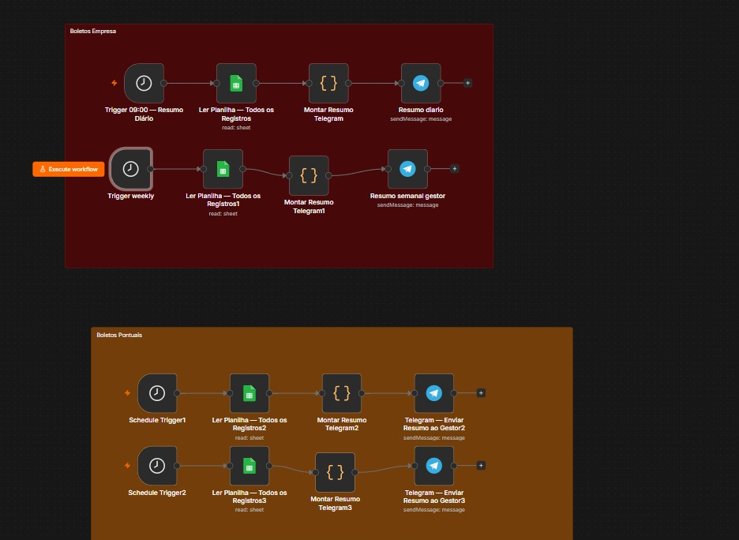
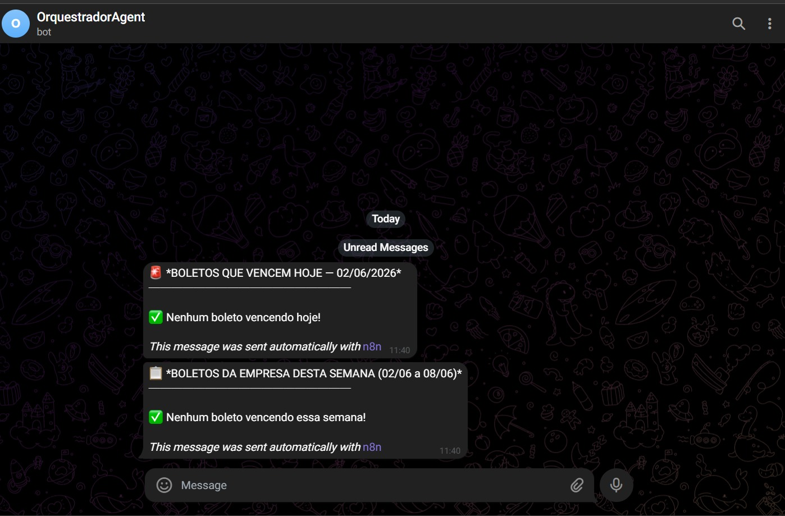

# 📋 BillTracker Automation

> Sistema de monitoramento inteligente de contas a pagar com alertas automáticos via Telegram.
<div align="center">

<h2>⚙️ Workflow no n8n</h2>

<a href="./assets/print-n8n.png">
  
</a>

<br><br><br>

<h2>📲 Resultado no Telegram</h2>

<a href="./assets/print-telegram.png">
  
</a>

</div>

---

## 📌 Sobre o Projeto

O **BillTracker Automation** é um sistema de monitoramento financeiro que lê uma planilha de contas a pagar no Google Sheets, processa regras de negócio sobre vencimentos e situação dos boletos, e entrega alertas inteligentes via Telegram — tudo de forma automática, sem nenhuma intervenção manual.

O sistema elimina o risco de boletos vencerem despercebidos, entregando informação proativa no momento certo.

---

## 🚨 Problema que Resolve

Pequenas e médias empresas perdem dinheiro com multas e juros por falta de controle de vencimentos. Planilhas são consultadas manualmente e de forma irregular. Este sistema automatiza esse controle e avisa o gestor todos os dias antes que seja tarde.

---

## ⚙️ Funcionalidades

- ✅ Alerta diário às 08h com boletos que vencem no dia
- ⛔ Detecção de boletos vencidos e em aberto no mês corrente
- 📋 Resumo semanal toda segunda-feira com boletos da semana
- 💸 Totalização automática em R$ por categoria de alerta
- 🔍 Filtro dinâmico de colunas — resiliente a mudanças na planilha
- 🔄 Tratamento de variações de status (`Aberto`, `Aberto!`, `em Aberto`)

---

## 🏗️ Arquitetura

```
TRIGGER LAYER
  └── Schedule Trigger (cron diário 0 8 * * * + semanal 0 8 * * 1)
         │
DATA LAYER
  └── Google Sheets API (OAuth2)
      └── Planilha de Contas a Pagar
         │
PROCESSING LAYER
  └── JavaScript Engine (n8n Code Node)
      ├── Dynamic key detection (Object.keys)
      ├── Date parsing DD/MM/YYYY (timezone-safe)
      ├── Business rules (vencimento / status)
      ├── Currency formatting pt-BR
      └── Message composition
         │
DELIVERY LAYER
  └── Telegram Bot API
      └── Mensagens formatadas com Markdown
```

---

## 🔄 Fluxo dos Workflows

### Workflow Diário — `0 8 * * *`
1. Schedule Trigger dispara às 08:00
2. Google Sheets node busca todos os registros via OAuth2
3. Code node detecta colunas dinamicamente via `Object.keys()`
4. Filtra registros com situação contendo `"aberto"`
5. Compara datas de vencimento com data atual
6. Separa em: **vence hoje** / **vencidos no mês**
7. Formata mensagens com totalizadores em BRL
8. Telegram node entrega até 2 mensagens ao gestor

### Workflow Semanal — `0 8 * * 1`
1. Schedule Trigger dispara toda segunda-feira
2. Mesmo pipeline de leitura e filtragem
3. Calcula janela seg→dom da semana atual
4. Entrega resumo semanal + boletos vencidos do mês

---

## 🛠️ Tech Stack

| Tecnologia | Função |
|---|---|
| **n8n** | Orquestração de workflows e agendamento |
| **Google Sheets API** | Fonte de dados via OAuth2 |
| **JavaScript ES6+** | Processamento e regras de negócio |
| **Telegram Bot API** | Canal de entrega de alertas |
| **Cron Expressions** | Agendamento temporal preciso |
| **Linux VPS** | Hospedagem em produção 24/7 |

---


---

## 📐 Estrutura da Planilha

| Coluna | Descrição |
|---|---|
| `Mes` | Mês de referência (ex: `junho`) |
| `Vencimento` | Data no formato `DD/MM/YYYY` |
| `Loja` | Nome do fornecedor |
| `Valor` | Valor numérico (ex: `496.25`) |
| `Situação` | Status: `Aberto`, `Aberto!`, `Pago!` |
| `Observação` | Descrição opcional |

---

## 🔎 Destaques Técnicos

**Detecção dinâmica de colunas**
```javascript
const chaveData = chaves.find(k => k.toLowerCase().includes('venc')) || 'Vencimento';
```
Usa `Object.keys()` com busca por substring — o pipeline não quebra se a planilha for renomeada.

**Parse de datas timezone-safe**
```javascript
function somenteData(d) {
  return new Date(d.getFullYear(), d.getMonth(), d.getDate());
}
```
Zera horas, minutos e segundos antes de comparar datas, evitando erros de fuso horário.

**Pipeline multi-output**
```javascript
return mensagens; // array com 1 ou 2 mensagens
```
Um workflow retorna múltiplos itens — o Telegram node itera e envia cada mensagem separadamente.

---

## 🔮 Melhorias Futuras

- [ ] Migração da fonte de dados para PostgreSQL / Supabase
- [ ] Integração com WhatsApp Business API
- [ ] Webhook para detectar mudanças na planilha em tempo real
- [ ] Endpoint REST para marcar boletos como pagos via chat
- [ ] Dashboard web com Chart.js para visualização mensal
- [ ] Suporte multi-tenant (múltiplos clientes)
- [ ] Histórico de notificações em banco de dados

---


---

<p align="center">
  Desenvolvido com n8n + Google Sheets API + Telegram Bot API
</p>
