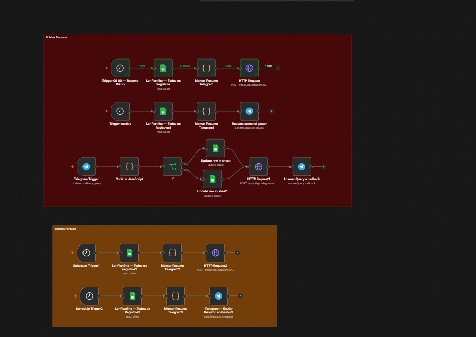
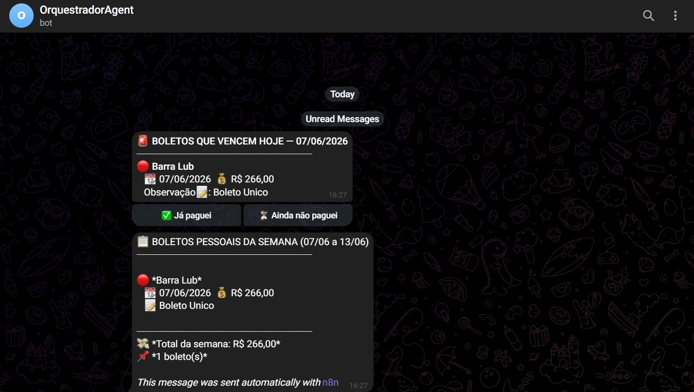

# 📊 BillTracker Automation
 
<p align="center">
  
  
  
  
  
  
</p>
<p align="center">
  Sistema de monitoramento financeiro que lê contas a pagar no Google Sheets e entrega alertas inteligentes via Telegram — automático, sem intervenção manual.
</p>

<h2>⚙️ Workflow no n8n</h2>

<a href="./assets/n8n.jpeg">
  
</a>

<br><br><br>

<h2>📲 Resultado no Telegram</h2>

<a href="./assets/telegram.jpeg">
  
</a>

</div>


---
 
## 🚨 O Problema
 
Pequenas e médias empresas perdem dinheiro com multas e juros por falta de controle de vencimentos. Planilhas são consultadas manualmente e de forma irregular.
 
**Uma única multa de 2% em um boleto de R$ 5.000 = R$ 100 perdidos.**
 
O BillTracker resolve isso entregando a informação certa, no momento certo, direto no celular do gestor.
 
---
 
## ✅ Funcionalidades
 
| Feature | Descrição |
|---|---|
| ⏰ Alerta diário | Todo dia às 08h com boletos que vencem no dia |
| ⛔ Detecção de atrasos | Boletos vencidos e em aberto no mês corrente |
| 📋 Resumo semanal | Toda segunda-feira com visão da semana completa |
| 💸 Totalização automática | Somatório em R$ por categoria de alerta |
| 🔍 Filtro dinâmico | Resiliente a mudanças nos nomes das colunas |
| 🔄 Normalização de status | Trata variações como `Aberto`, `Aberto!`, `em Aberto` |
 
---
 
## 🏗️ Arquitetura
 
```
TRIGGER LAYER
  └── Schedule Trigger (cron diário 0 8 * * * | semanal 0 8 * * 1)
         │
DATA LAYER
  └── Google Sheets API (OAuth2)
      └── Planilha de Contas a Pagar
         │
PROCESSING LAYER
  └── JavaScript Engine (n8n Code Node)
      ├── Dynamic key detection (Object.keys)
      ├── Date parsing DD/MM/YYYY (timezone-safe)
      ├── Business rules (vencimento / status)
      ├── Currency formatting pt-BR
      └── Message composition
         │
DELIVERY LAYER
  └── Telegram Bot API
      └── Mensagens formatadas com Markdown + botões de ação
```
 
---
 
## 🔄 Fluxo dos Workflows
 
### Workflow Diário — `0 8 * * *`
 
```
1. Schedule Trigger dispara às 08:00
2. Google Sheets node busca todos os registros via OAuth2
3. Code node detecta colunas dinamicamente via Object.keys()
4. Filtra registros com situação contendo "aberto"
5. Compara datas de vencimento com data atual
6. Separa em: vence hoje / vencidos no mês
7. Formata mensagens com totalizadores em BRL
8. Telegram node entrega até 2 mensagens ao gestor
```
 
### Workflow Semanal — `0 8 * * 1`
 
```
1. Schedule Trigger dispara toda segunda-feira
2. Mesmo pipeline de leitura e filtragem
3. Calcula janela seg→dom da semana atual
4. Entrega resumo semanal + boletos vencidos do mês
```
 
---
 
## 🛠️ Tech Stack
 
| Tecnologia | Versão | Função |
|---|---|---|
| **n8n** | Latest | Orquestração de workflows e agendamento |
| **Google Sheets API** | v4 | Fonte de dados via OAuth2 |
| **JavaScript** | ES6+ | Processamento e regras de negócio |
| **Telegram Bot API** | Latest | Canal de entrega de alertas |
| **Linux VPS** | Ubuntu 22.04 | Hospedagem em produção 24/7 |
 
---
 
## 📐 Estrutura da Planilha
 
| Coluna | Tipo | Descrição | Exemplo |
|---|---|---|---|
| `Mes` | String | Mês de referência | `junho` |
| `Vencimento` | String | Data no formato DD/MM/YYYY | `15/06/2026` |
| `Loja` | String | Nome do fornecedor | `Barra Lub` |
| `Valor` | Number | Valor numérico | `496.25` |
| `Situação` | String | Status do boleto | `Aberto`, `Pago!` |
| `Observação` | String | Descrição opcional | `Boleto Único` |
 
> **Importante:** os nomes exatos das colunas não precisam coincidir — o sistema detecta automaticamente por similaridade de texto.
 
---
 
## 🔎 Destaques Técnicos
 
### Detecção dinâmica de colunas
```javascript
const chaveData = chaves.find(k => k.toLowerCase().includes('venc')) || 'Vencimento';
```
Usa `Object.keys()` com busca por substring. O pipeline não quebra se a planilha for renomeada.
 
### Parse de datas timezone-safe
```javascript
function somenteData(d) {
  return new Date(d.getFullYear(), d.getMonth(), d.getDate());
}
```
Zera horas, minutos e segundos antes de comparar — evita erros de fuso horário em ambientes Linux.
 
### Pipeline multi-output
```javascript
return mensagens; // array com 1 ou 2 mensagens
```
Um único workflow retorna múltiplos itens. O Telegram node itera e envia cada mensagem separadamente.
 

 
---
 
## 📁 Estrutura do Projeto
 
```
billtracker-automation/
├── workflows/
│   ├── daily-alert.json        # Workflow de alerta diário
│   └── weekly-summary.json     # Workflow de resumo semanal
├── docs/
│   └── planilha-modelo.xlsx    # Modelo de planilha compatível
└── README.md
```
 
---
 
## 🔮 Roadmap
 
- [ ] Cadastro de novos boletos direto pelo bot — sem abrir planilha
- [ ] Migração da fonte de dados para PostgreSQL / Supabase
- [ ] Integração com WhatsApp Business API
- [ ] Webhook para detectar mudanças na planilha em tempo real
- [ ] Dashboard web com Chart.js para visualização mensal
- [ ] Suporte multi-tenant (múltiplos clientes / empresas)
- [ ] Histórico de notificações em banco de dados
---
 

## 📬 Contato
 
Tem uma empresa e quer um sistema como esse personalizado para o seu negócio?
 
**Me manda uma mensagem:** [LinkedIn](https://linkedin.com/in/seu-perfil) | [Telegram](https://t.me/seu-usuario)
 
---
 
<p align="center">
  Feito com ⚡ usando n8n — <em>automatize o que é repetitivo, foque no que importa.</em>
</p>
  Desenvolvido com n8n + Google Sheets API + Telegram Bot API
</p>
